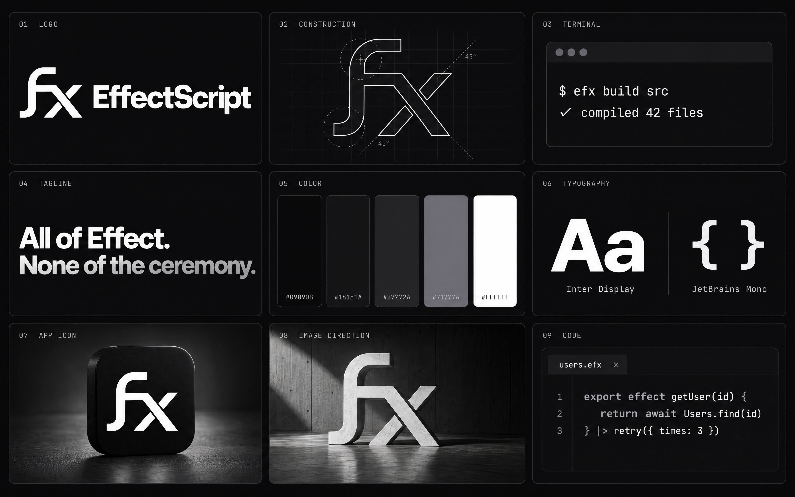
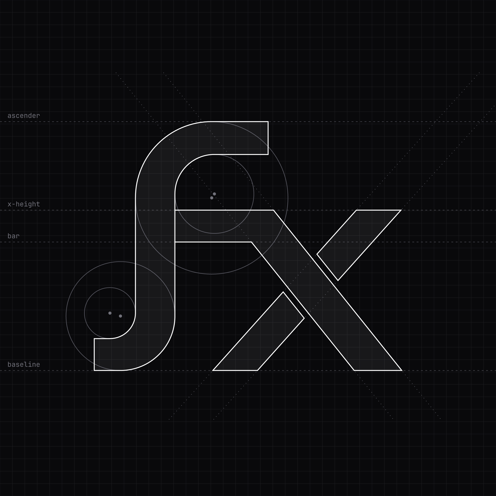
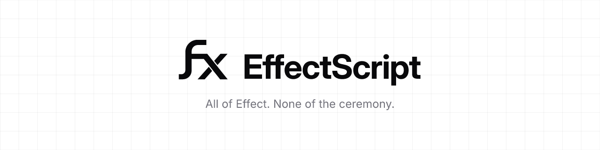

# EffectScript brand

EffectScript is TypeScript with Effect built into the language. The identity is
designed to sit inside the Effect ecosystem without being part of it: the same
monochrome palette, the same Inter and JetBrains Mono pairing, and the same
grid-and-terminal restraint as effect.website, with a mark of its own. It never
uses the Effect logo. Describe the relationship as "built on Effect" or
"compiles to Effect", never as an official Effect product.

**Tagline:** All of Effect. None of the ceremony.



## Naming

| Thing      | Rule                                                                    |
| ---------- | ----------------------------------------------------------------------- |
| Name       | **EffectScript**: one word, capital E and S                             |
| Short name | **efx**: the file extension, the CLI, and casual speech ("an efx file") |
| Symbol     | **ƒx**: only ever drawn as the logo, never written or said as a name    |
| Package    | **`effectscript`** on npm (`efx` is taken by an unrelated package)      |
| Never      | "FX", "Fx", "EFX", "Effect Script"                                      |

"fx" as a name is crowded: `@typed/fx` in the Effect ecosystem, the `fx` JSON
viewer, the FX TV network, and the spreadsheet ƒx button. That is why the
symbol stays a symbol. Wherever people meet the brand for the first time (link
previews, banners, READMEs), show the full lockup. Use the symbol alone only
where the product is already known: favicon, file icon, avatar.

## The mark

The mark is a ligature of a function-hook **ƒ** and an **x**. It is a symbol,
like Haskell's `>λ=`, not an abbreviation. It shows the language's central
construct: `effect getUser() {}` compiles to `Effect.fn("getUser")(…)`, so the
ƒ is that function and the x is the effect it produces. Next to a filename it
pairs with the extension: the ƒx icon beside `users.efx`.

The crossbar of the ƒ does not stop at the stem. It continues as one stroke
into the thick diagonal of the x, so the letter itself flows forward the way
the `|>` pipeline does. Where that stroke passes over the thin diagonal, the thin
diagonal is cut by a small gap.

The mark is exact geometry, not a trace. [`scripts/mark.py`](scripts/mark.py)
defines it: two pairs of arcs for the hooks, a stem, a crossbar, and two
diagonals with slopes of 0.8 and −0.895.



| Rule         | Value                                                                                   |
| ------------ | --------------------------------------------------------------------------------------- |
| Clear space  | Mark alone: half the mark's height on every side. Lockups: one wordmark cap height.     |
| Minimum size | Mark: 16 px. Horizontal lockup: 96 px wide on screen, 20 mm in print.                   |
| Small sizes  | At 32 px and below, use the solid mark (no crossing gaps), as the favicons do.          |
| Colour       | White on black or black on white only. No tints, gradients, outlines or effects.        |
| Lockup       | Mark height is 1.62 × the wordmark cap height. Gap is 0.62 × cap height. Do not redraw. |
| Don't        | Stretch, rotate, recolour, add the Effect logo, or set the name in another typeface.    |

## Colour

The palette is Effect's own: Tailwind zinc on near-black. White carries the
brand. Grays are for hierarchy.

| Token  | Hex       | Use                                       |
| ------ | --------- | ----------------------------------------- |
| Ink    | `#09090B` | Page background (zinc-950)                |
| Tile   | `#18181A` | Icon tiles, favicon, cards                |
| Line   | `#27272A` | Hairlines, borders, grids (zinc-800)      |
| Muted  | `#71717A` | Labels, the far end of headline gradients |
| Subtle | `#A1A1AA` | Secondary text (zinc-400)                 |
| White  | `#FFFFFF` | Mark, wordmark, headlines                 |

Headlines may use the effect.website treatment: white for the first ~60% of
the line, fading to `#71717A` at the end.

## Typography

| Role                | Typeface               | Notes                                                       |
| ------------------- | ---------------------- | ----------------------------------------------------------- |
| Wordmark, headlines | Inter Display Bold     | Tracking −2.2% (wordmark), −2.5% heads                      |
| Body                | Inter Regular / Medium |                                                             |
| Code, labels        | JetBrains Mono         | Ligatures off for code; `// LABELS` uppercase, +6% tracking |

Both are SIL Open Font License fonts and are included in [`fonts/`](fonts)
with their licences. All logo files use outlined type, so they need no fonts.

## Files

| Folder                         | Contents                                                                                                       |
| ------------------------------ | -------------------------------------------------------------------------------------------------------------- |
| [`logo/svg`](logo/svg)         | Mark, wordmark, horizontal and stacked lockups in white and black; `effectscript-mark.svg` uses `currentColor` |
| [`logo/png`](logo/png)         | The same at 512–2048 px with transparency, plus lockups on black and white with clear space                    |
| [`icons`](icons)               | `favicon.svg`/`.ico`/16–48 px, `apple-touch-icon.png`, 192/512/maskable PWA icons, `site.webmanifest`          |
| [`icons/app`](icons/app)       | macOS `AppIcon.icns`, iOS 1024, Windows `.ico`, `.efx` document icons                                          |
| [`icons/editor`](icons/editor) | VS Code / Open VSX extension icon (128, 256) and 16 px `.efx` file icons for dark and light themes             |
| [`social`](social)             | Avatars, banners and post templates per platform (below)                                                       |
| [`key-visuals`](key-visuals)   | The image world: monolith, ceremony, emboss, tall monolith, merch, brand boards                                |
| [`motion`](motion)             | Logo and mark reveals: MP4, WebM, GIF, poster frames (16:9, 1:1, 9:16)                                         |
| [`merch`](merch)               | Die-cut sticker artwork and single-colour solid marks for embroidery and print                                 |
| [`wallpapers`](wallpapers)     | Desktop 2560 / 3840, phone 1170×2532 / 1440×3200                                                               |

### Platform sizes

| Platform     | Files                                                                                                                                       |
| ------------ | ------------------------------------------------------------------------------------------------------------------------------------------- |
| Web          | `web/og-image.jpg` 1200×630, `web/twitter-card.jpg` 1200×600, `web/hero-banner-3x1.jpg` 3840×1280                                           |
| GitHub       | `github/github-social-preview.jpg` 1280×640, `github/github-avatar.png` 500, `readme-banner-{dark,light}.png` 1280×320                      |
| X            | `x/x-header.jpg` 1500×500, `x/x-avatar.png` 400, `x-post-compare.png` and `x-post-features.png` 1600×900, `x-post-portrait.jpg` 1080×1350   |
| LinkedIn     | `linkedin/linkedin-banner.jpg` 1584×396, `linkedin-page-cover.jpg` 1128×191, `linkedin-logo.png` 400, `linkedin-post-compare.png` 1080×1350 |
| YouTube      | `youtube/youtube-banner.jpg` 2560×1440 (logo inside the 1546×423 safe area), `youtube-thumbnail.jpg` 1280×720, `youtube-avatar.png` 800     |
| Discord      | `discord/discord-server-icon.png` 512, `discord-server-banner.jpg` 960×540, `discord-invite-splash.jpg` 1920×1080                           |
| Bluesky      | `bluesky/bluesky-banner.jpg` 3000×1000, `bluesky-avatar.png` 1000                                                                           |
| Mastodon     | `mastodon/mastodon-header.jpg` 1500×500, `mastodon-avatar.png` 400                                                                          |
| Instagram    | `instagram/instagram-post.jpg` 1080², `instagram-post-compare.png` 1080×1350, `instagram-story.jpg` 1080×1920                               |
| Product Hunt | `producthunt/producthunt-thumbnail.png` 240, `producthunt-gallery-{1,2,3}` 1270×760                                                         |
| Reddit       | `reddit/reddit-banner.jpg` 1920×384, `reddit-icon.png` 256                                                                                  |
| Others       | `npm/npm-avatar.png`, `twitch/twitch-avatar.png`, `slack/emoji-efx*.png` 128, `blog/blog-cover-*`, `slides/slide-title-1920x1080.jpg`       |

## Snippets

```html
<link rel="icon" href="/favicon.ico" sizes="48x48" />
<link rel="icon" href="/favicon.svg" type="image/svg+xml" />
<link rel="apple-touch-icon" href="/apple-touch-icon.png" />
<link rel="manifest" href="/site.webmanifest" />
<meta name="theme-color" content="#09090B" />
<meta property="og:image" content="/og-image.jpg" />
<meta name="twitter:card" content="summary_large_image" />
```

```html
<picture>
  <source media="(prefers-color-scheme: dark)" srcset="social/github/readme-banner-dark.png" />
  
</picture>
```

VS Code extension `package.json`: `"icon": "extension-icon-128.png"` and
`"galleryBanner": { "color": "#09090B", "theme": "dark" }`.

## Rebuilding

Everything except the key visuals is generated from code. Requirements are
`resvg`, `oxipng`, ImageMagick, `ffmpeg` and, for `.icns`, macOS `iconutil`.

```bash
uv run --with fonttools --with uharfbuzz --with pillow scripts/build_logo.py
uv run --with fonttools --with uharfbuzz --with pillow scripts/social.py
uv run --with fonttools --with uharfbuzz --with pillow scripts/merch.py
uv run --with fonttools --with uharfbuzz --with pillow scripts/motion.py
```

## Provenance

The key visuals in `key-visuals/` were generated with OpenAI GPT Image 2.5
(Sunburst, quality `max`) using the vector mark as a reference, then checked by
hand. The merch stickers were replaced with renders of the vector mark.
Lossless PNG masters and their prompts sit in the git-ignored `.gen/` queues.
Keep them with the brand if the assets are transferred.

The mark began as a generated concept and was then redrawn as the explicit
geometry in `scripts/mark.py`. Every logo, icon and layout comes from that
geometry and from Inter Display outlines. If ownership of the identity will be
transferred or registered, keep the vector construction as the authoritative
source. Copyright protection for purely AI-generated imagery varies by
jurisdiction.
